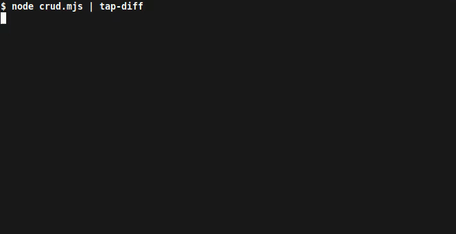

# Instruments DB E2E
## Automated REST API end-to-end test suit in Tape
This test suite validates the functionality of the [Instruments DB API](https://instruments-db.xyz) and ensures that it meets the requirements defined in the Instruments DB [OpenAPI specification](./app/swagger.json).
* [Why Tape?](#why-tape)
* [Dependencies](#dependencies)
* [Overview](#overview)
    * [Request configuration](#request-configuration)
    * [Sending requests](#sending-requests)
    * [Assertions](#assertions)
    * [Response validation](#response-validation)
    * [Helper functions](#helper-functions)
    * [Test cases Map object](#test-cases-map-object)
    * [Randomly selected values](#ranbomly-selected-values)
    * [Input data generation](#random-data-generation)
    * [Pairwise testing](#pairwise-testing)
    * [Database queries](#ranbomly-selected-values)
    * [The `onFailure()` hook](#the-onfailure-hook)
* [Positive testing](#positive-testing)
    * [CRUD](#crud)
    * [Search, sorting and pagination](#search-sorting-and-pagination)
        * [Search functionality test](#search-functionality-test)
        * [Pairwise search, sorting and pagination test](#pairwise-search-sorting-and-pagination-test)
* [Negative testing](#negative-testing)
    * [Authentication](#authentication)
    * [Input validation](#input-validation)
        * [Invalid request body](#invalid-request-body)
        * [Invalid query parameters](#invalid-query-parameters)
        * [Invalid path parameters](#invalid-path-parameters)
    * [Error handling](#error-handling)
## Why Tape?
Some tests within the suite involve a large number of test cases, which remain significant even after applying the pairwise technique. To achieve thorough test coverage, dynamic generation of test cases and asynchronous iteration are necessary. This is where things become tricky with some other JavaScript testing frameworks. However, Tape allows the use of asynchronous loops and generator functions, making it relatively straightforward to iterate through test cases.
## Dependencies
 - node.js (v18 or higher)
 - @faker-js/faker ^8.0.2
 - ajv ^8.12.0
 - axios ^1.4.0
 - diacritics ^1.3.0
 - dotenv ^16.1.4
 - mongodb ^5.6.0
 - pict-pairwise-testing ^1.1.0
 - tape ^5.6.3
## Overview
The test suite is organized as a collection of separate scripts that can be run using the `node` command. The output can be piped into a TAP reporter of preference:
```bash
node crud.mjs | tap-diff
```


Each test case of this suite is a Tape `test()` function with an asynchronous callback:
```javascript
function crudTest() {

    let _id, body, request, response

    test("Adding a new instrument", async (t) => { 
        // Test case logic...
    })
    // Other test cases...
}
```
Certain variables need to be declared outside of the `test()` function in order to be shared between test cases and to be accessible inside the [`onFailure()`](#the-onfailure-hook) hook.
### Request configuration
Request parameters, either manually preset or dynamically generated, are set up within the Axios request configuration object:
```javascript
{
    url: "/api",
    method: "POST",
    headers: {
        "API-Key": process.env.API_KEY,
    },
    body: new Body()
}
```
### Sending requests
The [`sendRequest()`](./test/utils/helpers.mjs#L14) function serves as a wrapper for Axios. It accepts the request configuration object as its argument, prepends the base URL, handles exceptions, and returns the Axios response object with the measured response time:
```javascript
async function sendRequest(reqParams) {
    try {
        const start = new Date()    // <-- 
        const response = await axios({
            baseURL: process.env.BASE_URL,  // This straightforward method of measuring
            ...reqParams                    // response time is nonetheless accurate
        })
        const end = new Date()    // <-- 
        return {
        time: end - start,
        ...response
        }
    } catch (error) {
        console.error(error)
    }
}
```
### Assertions
Values extracted from the response object are validated using built-in Tape assertion methods:
```javascript
const {
        time,
        status,
        headers,
        data
    } = response = await sendRequest(request)
    t.is(
        status,
        201,
        "Status: 201 Created"
    )
```
The following assertions are common for all test cases in the suite:
- Expected status code: Each test case expects a specific status code as a response from the API.
- Expected headers: The headers returned in the API response are compared against the expected headers.
- Valid response body: The response body is validated against its corresponding JSON schema defined in the Instruments DB specification.

Other assertions are specific to the purpose and scenario of each test case.
### Response validation   
Response headers and body are validated using ajv:
```javascript
import { responses } from "./schemas.mjs"

const ajv = new Ajv({ allErrors: true, schemas: [responses] })

function validate(object, schema) {
    const valid = ajv.getSchema(`responses#/$defs/${schema}`)
    return valid(object) || valid.errors
}
```
The `responses` schema contains internal references that need to be resolved by the `ajv.getSchema()` method.
### Helper functions
The test suite uses multiple helper functions defined in the [helpers.mjs](./test/utils/helpers.mjs) file, for example:
```javascript
export async function* nextPage(query) {
    let page = 1
    while (true) {
        const request = {
            url: "/api",
            method: "GET",
            params: {
                page,
                ...query
            }
        }
        const response = await sendRequest(request)
        yield {
            request,
            response
        }
        page++
        if (!response.data.next) {
            return
        }
    }
}
```
The [`nextPage()`](./test/utils/helpers.mjs#L33) async generator function allows to iterate through all of the existing pages with search and pagination parameters passed as the argument.
### Test cases Map object
Map objects are used to store functions that generate request configuration parameters for different test cases:
```javascript
export const testCases = new Map()
        .set("Normal search parameters", async () => {
            return {
                orig: await searchString()
            }
        })
        // More test cases as chained set() methods' arguments
```
In tests that involve multiple test cases `for...of` loops are used to iterate through Map objects:
```javascript
test("Search functionality test", async (t) => {
    for (const [descr, params] of testCases) {
        // Test case logic...
    }
})
```
### Randomly selected values
In certain test cases, to avoid nesting additional `for...of` loops, a random value is selected as a request parameter instead of iterating through all possible values:
```javascript
        .set("Case insensitivity check", async () => {
            const orig = await searchString()
            return {
                orig,
                mod: pickOne(
                    [
                        orig.toLowerCase(),
                        orig.toUpperCase()
                    ]
                )
            }
        })
```
This approach allows to achieve comprehensive test coverage and variability across multiple test suite iterations without adding excessive complexity.
### Input data generation
Faker library is utilized to generate random data for test cases. For example, the [`Body`](./test/utils/helpers.mjs#L58) class generates valid and somewhat realistic request bodies:
```javascript
export class Body {
    name = faker.word.noun()
    type = pickOne(Body.types)
    invented = int(2023).toString()
    origin = faker.location.country()
    static arrayProps = {
        musicians: faker.person.fullName,
        songs: faker.music.songName,
        brands: faker.company.name,
        tags: faker.word.adjective
    }
    static types = [
        "Bowed string",
        "Plucked string",
        "Woodwind",
        "Brass",
        "Percussion",
        "Keyboard",
        "Other"
    ]
    constructor() {
        for (const prop in Body.arrayProps) {
            this[prop] = uniqueArray(
                Body.arrayProps[prop],
                int({ min: 1, max: 5 })
            )
        }
    }
}
```
### Pairwise testing 
Pairwise testing is an optimization technique that allows to achieve reasonable test coverage while significantly reducing the number of test cases. Instead of testing all possible combinations of parameters, only all possible pairs of parameters are included in test cases. The `pairwise` object defines the parameters and their possible values:
```javascript
const pairwise = {
	parameters: [
		{
			property: "search",
			values: [true, false]
		},
		{
			property: "sort_by",
			values: ["_id", "name", "default"]
		},
		{
			property: "sort_direction",
			values: ["asc", "desc", "default"]
		},
		{
			property: "page_size",
			values: [5, 10, 25, "default"]
		}
	]
}
```
The `pict()` method of the pict-pairwise-testing library is used to generate an array of all parameter pairs. The [`generateTestCase()`](./test/test_cases/search_pagination.mjs#L55) function constructs test cases and returns an iterable generator:
```javascript
const allPairs = pict(pairwise).testCases

export async function* generateTestCase() {
	for (const query of allPairs) {
		query.search = JSON.parse(query.search)
			? await searchString()
			: undefined
		const descr = (
			query.search
				? `Search: "${query.search}"`
				: "No search parameters"
		)
			+ `, page size: ${query.page_size}`
			+ `, sort_by: ${query.sort_by}`
			+ `, sort_direction: ${query.sort_direction}`
		for (const param in query) {
			if (query[param] === "default") {
				delete query[param]
			}
		}
		yield {
			descr,
			query
		}
	}
}
```
### Database queries
In certain scenarios, direct MongoDB queries are performed to retrieve necessary data. For example, the [`getSample()`](./test/utils/helpers.mjs#L102) function returns a random sample document from the "instruments" collection:
```javascript
const client = new MongoClient(process.env.MONGO_URI)
const db = client.db().collection("instruments")

export async function getSample() {
    try {
        await client.connect()
        const [sample] = await db.aggregate([
            {
                $sample: {
                    size: 1
                }
            }
        ]).toArray()
        await client.close()
        return sample
    } catch (error) {
        console.error(error)
    }
}
```
### The `onFailure()` hook
This Tape hook gets invoked whenever a test fails and can be configured to perform actions such as outputting info for debugging, stopping test execution or writing into a file:
```javascript
test.onFailure(() => {
    reportAndBail(request, response)
})
```
## Positive testing
Positive testing focuses on validating the expected behavior and functionality of the Instruments DB API under normal conditions and with valid inputs to ensure that the system operates as intended.
## CRUD
[CRUD test](./test/crud.mjs) covers the fundamental operations of creating, reading, updating, and deleting instruments in the Instruments DB API. It ncludes the following test cases:
 - Adding a new instrument: Sends a POST request to create a new instrument.
 - Finding the instrument: Retrieves the created instrument using its identifier.
 - Updating the instrument: Modifies the instrument with a PUT request.
 - Checking if updated: Validates that the changes were applied to the instrument.
 - Deleting the instrument: Sends a DELETE request to remove the instrument.
 - Checking if deleted: Ensures that the instrument is no longer accessible.
## Search, sorting and pagination
Instruments DB API allows users to search for instruments, apply sorting criteria, and navigate through large result sets using pagination. [This group of tests](./test/search_pagination.mjs) evaluates the functionality of this feature (test cases are defined in a separate file, [here](./test/test_cases/search_pagination.mjs)).
### Search functionality test
The search functionality test verifies the effectiveness and accuracy of the search in the Instruments DB API. It includes the following test cases:
 - Normal search parameters: Evaluates the search functionality with typical search parameters.
 - Case insensitivity check: Validates that the search returns the same results regardless of the letter case used in the search query.
 - Diacritic insensitivity check: Ensures that the search is insensitive to diacritic marks, such as accents or umlauts.
### Pairwise search, sorting and pagination test
Test cases are dynamically generated using the pict-pairwise-testing library (described in [Pairwise testing](#pairwise-testing)). The test iterates through all existing pages for each generated set of query parameters:
```javascript
test("Pairwise search, sorting and pagination test", async (t) => {
    for await (const { descr, query } of generateTestCase()) {
        t.comment(descr)
        const expCount = await getCount(query.search)
        let count = 0
        for await ({ request, response } of nextPage(query)) {
           // Further test case logic...
        }
    }
})
```
This test includes assertions that check the expected number of items on the page, the number of skipped items, sorting in the expected order, relevance of search results, and the expected number of search results.
## Negative testing
Negative testing focuses on the system's ability to handle unexpected or invalid inputs. It aims to intentionally provoke errors to ensure that the system behaves correctly in such scenarios. Each test case includes assertions that verify the API response has an expected 40* status code and a relevant error message.
## Authentication
[Authentication test](./test/authentication.mjs) validates the system's ability to handle unexpected or invalid authentication attempts. Includes the following scenarios:
 - Missing API-Key header: Simulates an authentication attempt without providing the required API-Key header.
 - Incorrect API key value: Provides an incorrect API key value in the API-Key header.
 - Invalid API key: Attempts to authenticate with an invalid API key. 
## Input validation
[Input validation tests](./test/input_validation.mjs) specifically focus on testing the system's response to various forms of invalid input (test cases are defined in a separate file, [here](./test/test_cases/input_validation.mjs)).
### Invalid request body
This test focuses on the system's ability to handle invalid request bodies that do not conform to the corresponding JSON schema requirements. It includes the following test cases:
 - Additional property: Modifies a valid request body by adding an extra property that is not allowed by the JSON schema.
 - Missing property: Intentionally removes a required property from a valid request body.
 - Wrong type of data: Modifies a request body by changing the data type of a property to an incorrect type.
 - Exceeded limit: Provides a request body where a property value exceeds the allowed limit specified in the JSON schema.
 - Forbidden character: Includes a property value that contains a forbidden character according to the JSON schema restrictions.
 - Duplicate items: Adds duplicates to a property that should not contain duplicate items.
 - Not allowed value: Modifies a valid request body by assigning a value to a property that is not included in the list of allowed values according to the JSON schema.
### Invalid query parameters
The test evaluates the system's behavior when encountering invalid query parameters in API requests. The test cases include various scenarios where query parameters are intentionally modified to be invalid, such as:
 - Additional parameter: Includes an extra parameter that is not supported by the API endpoint.
 - Multiple parameter values: Provides multiple values for a single query parameter, which is not allowed by the API specification.
 - Forbidden character: Uses a query parameter value that contains a character not allowed by the API's input restrictions.
 - Exceeded limit: Tests the system's response when a query parameter value exceeds the allowed limit, such as exceeding the maximum character length.
 - Not allowed value: Supplies a query parameter value that is not expected according to the API's defined requirements.
### Invalid path parameters
Examines the API's behavior when receiving requests with invalid path parameters. The test cases cover the following scenarios:
 - Forbidden character: Intentionally includes characters that are not allowed according to the API's input restrictions.
 - Exceeded limit: Sends a path parameter value that exceeds the defined constraints.
## Error handling
[Error handling tests](./test/error_handling.mjs) focus on the system's ability to handle and respond to various types of errors encountered during API requests. Includes the following scenarios:
 - Adding an instrument that already exists: Attempting to add an instrument with a name that already exists in the database and must be unique.
 - Changing an instrument's name to an existing one: Attempting to change an instrument's name to a unique name that already exists in the database. 
 - Searching for a non-existent instrument: Examines the system's response when searching for an instrument that does not exist in the database.
 - Non-existent _id: Providing a non-existent _id as the path parameter in an API request.
 - Page doesn't exist: Trying to access a page that does not exist.
 - Unsupported HTTP methods: Sending requests with HTTP methods that are not supported by certain endpoints.
 - Endpoint doesn't exist: Trying to access an endpoint that does not exist.